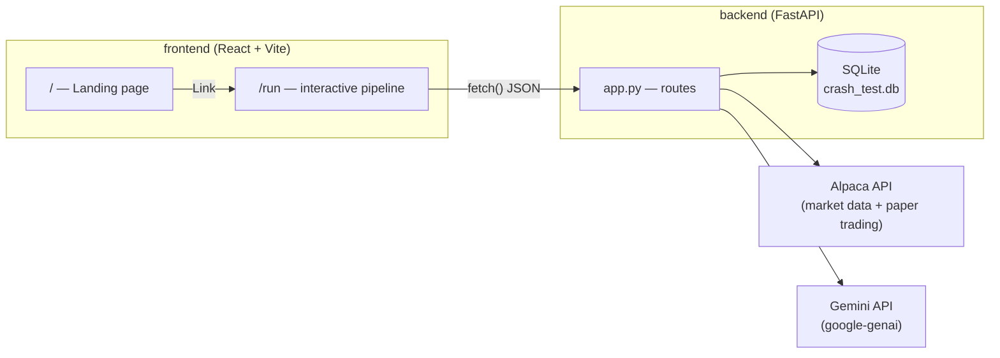
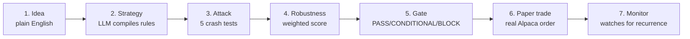

# GAUNTLET — Architecture

A quick technical overview for anyone evaluating or extending the codebase — how the
frontend, backend, and external services connect, and where the project's two safety
rules are actually enforced in code. For setup instructions, see the root
[README.md](README.md), [backend/README.md](backend/README.md), and
[frontend/README.md](frontend/README.md) instead.

## System overview



Two single-purpose services. The frontend never talks to Alpaca or Gemini directly —
every external call goes through the FastAPI backend, and within the backend, every
external dependency has exactly **one** point of contact:

| Dependency | Single point of contact |
|---|---|
| Alpaca (market data + paper orders) | [`backend/alpaca_client.py`](backend/alpaca_client.py) |
| Gemini (LLM) | [`backend/agents/llm_client.py`](backend/agents/llm_client.py) |
| SQLite (audit trail) | [`backend/db/database.py`](backend/db/database.py) |

That's deliberate: swapping the LLM provider (this project moved from Anthropic to
Gemini mid-build) only ever touches `llm_client.py` — nothing else in the codebase
needed to change.

## The pipeline, stage by stage



| Stage | Route | Backend module | LLM involved? |
|---|---|---|---|
| Compile | `POST /compile-strategy` | [`agents/strategy_compiler.py`](backend/agents/strategy_compiler.py) | Yes — English → strict `Strategy` contract |
| Backtest | `POST /crash-test/{id}` | [`backtest/engine.py`](backend/backtest/engine.py), [`backtest/metrics.py`](backend/backtest/metrics.py) | No |
| Crash test (5 attacks) | `POST /crash-test/{id}` (same call) | [`crash/engine.py`](backend/crash/engine.py) + `crash/{regime,parameters,drawdown,shocks}.py` | No |
| Explain | `GET /crash-test/{id}/explain` | [`agents/crash_analyst.py`](backend/agents/crash_analyst.py) | Yes — numbers → prose only, cannot alter them |
| Gate | `POST /risk-gate/{id}` | [`risk/gate.py`](backend/risk/gate.py) | No |
| Paper trade | `POST /paper-trade/{id}` | [`trading/paper.py`](backend/trading/paper.py) | No |
| Monitor | `GET /monitor/{id}` | [`trading/monitor.py`](backend/trading/monitor.py) | No |

Backtest and crash-test are one API call (`/crash-test/{id}`) because the crash tests
each need their own backtest run — see `crash/engine.py`'s `run_all()`.

### Why only 2 of 7 stages touch an LLM

Everything that produces a number — the backtest, all 5 crash tests, the weighted
robustness score, the gate decision — is plain pandas/numpy math with no model in the
loop, so it's deterministic and reproducible. The two LLM calls are read-only relative
to that math: one turns English into a structured request *before* any number exists,
the other narrates numbers that already exist. Neither can feed back into the score.

### Monitor coverage (partial, on purpose)

`trading/monitor.py` only re-checks 3 of the 5 crash-test failure modes live
(`volatility_stress`, `drawdown_resilience`, `market_reversal`) — each maps onto a
simple metric computed from recent price bars. The other two don't reduce to a live
market signal the same way: `parameter_sensitivity` is a property of the strategy's
*parameters*, not current market data, and `historical_robustness` is inherently a
backward-looking, multi-period comparison. Re-checking those would mean re-running
perturbed backtests on a schedule, not comparing one live number — out of scope here.

## The two safety rules

**Rule 1 — Scoring is deterministic; the LLM never touches it.**
Enforced by construction: `agents/strategy_compiler.py` and `agents/crash_analyst.py`
are the only two files that import `agents/llm_client.py`. Neither has write access to
`crash/engine.py`'s score, `risk/gate.py`'s decision, or the database — they only ever
read a `Strategy` in, or a `crash_test_summary` dict in, and hand back JSON or prose.

**Rule 2 — Live trading is hard-blocked, not a config flag.**
Enforced at three independent points, any one of which is sufficient on its own:
1. [`config.py`](backend/config.py)'s `Settings.validate()` refuses to start the app
   if `ALPACA_PAPER` isn't `true`.
2. [`alpaca_client.py`](backend/alpaca_client.py) hard-codes `paper=True` on the
   Alpaca `TradingClient` regardless of what config says.
3. [`trading/paper.py`](backend/trading/paper.py)'s `submit_paper_order()`
   independently re-checks `settings.ALPACA_PAPER` before submitting anything, so no
   code path can reach Alpaca without passing through this check too.

## Data contracts

Everything downstream of the compiler validates against pydantic models in
[`models/strategy.py`](backend/models/strategy.py):

- **`Strategy`** — the only shape the compiler agent is allowed to produce (symbol,
  SMA entry/exit rules, position size, benchmark). If the LLM returns something that
  doesn't validate against this, the request fails before reaching the backtester —
  an LLM producing syntactically-valid-but-wrong JSON never reaches real logic.
- **`CrashTestResult`** — the shape every one of the 5 crash tests returns
  (`test_type`, `score`, `severity`, `passed`, `metrics`, `failure_reason`,
  `evidence`). `crash/engine.py` combines 5 of these into the final summary.

## Frontend structure

```
frontend/src/
  pages/Landing.tsx    the "/" route — explains the agent, no live pipeline state
  pages/Run.tsx         the "/run" route — owns all pipeline state, calls lib/api.ts
  lib/api.ts             single point of contact with the backend — components never fetch() directly
  components/            presentational pieces (Gauge, CrashSequence, GateVerdict, ...)
```

`Run.tsx` is the only component that holds pipeline state (`phase`, `runId`,
`crashSummary`, etc.) and calls the backend; everything under `components/` is handed
data as props and renders it. `CrashSequence.tsx` is the one exception with its own
local animation state (which of the 5 results has "landed" yet) — purely a display
concern, not pipeline state.

## Persistence

`backend/db/database.py` writes one row per run to SQLite
(`backend/crash_test.db`, gitignored) — strategy, crash-test summary, gate decision,
and any order, updated as the pipeline progresses. It's the audit trail: `GET /runs`
and `GET /runs/{id}` expose it, so nothing in a demo or review is "trust me, it
happened." No ORM — five small, explicit SQL statements.
